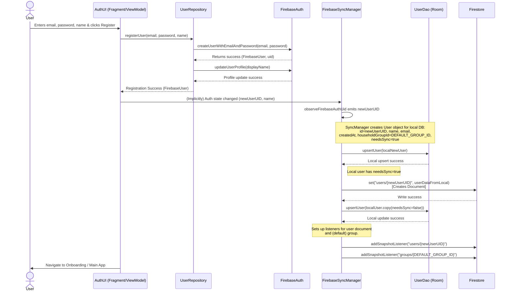
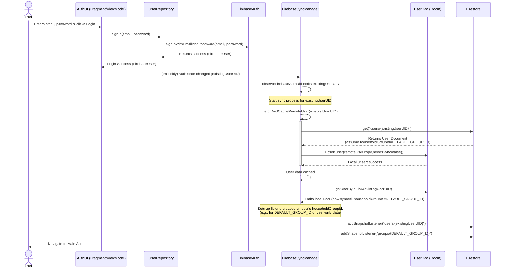
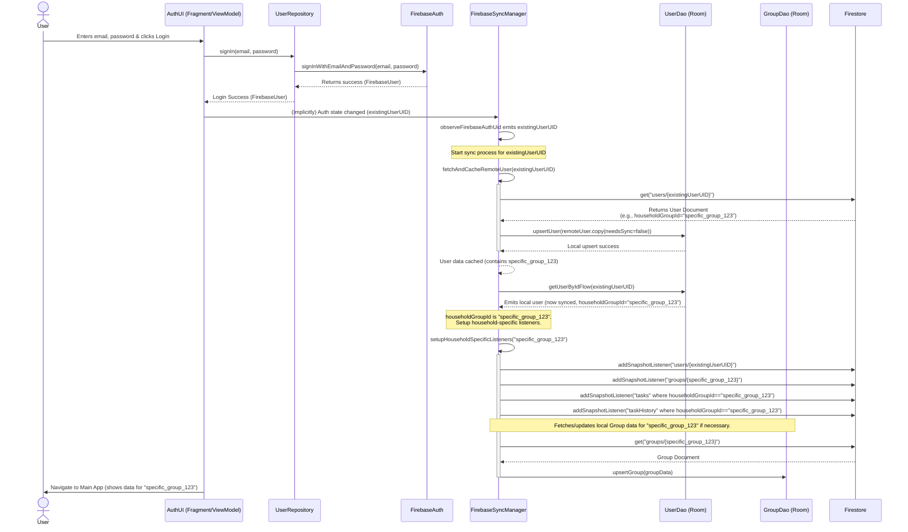

# Auth Sequence

**Core Responsibilities for `UserRepository` (Stricter Adherence to Offline-First & Your Goals):**

1.  **Firebase Authentication:**
    *   Handles all direct interactions with `FirebaseAuth` for:
        *   User registration (e.g., `createUserWithEmailAndPassword`).
        *   User sign-in (e.g., `signInWithEmailAndPassword`).
        *   User sign-out (`auth.signOut()`).
        *   Password reset (`auth.sendPasswordResetEmail()`).
        *   Observing auth state changes (`auth.addAuthStateListener()`, exposed as `observeFirebaseAuthUid()`).
        *   Getting the current `FirebaseUser` object (`auth.currentUser`) and its UID.
2.  **Firebase Auth User Profile Updates (Auth-Specific Fields Only):**
    *   Handles updates to the `FirebaseUser` object itself for fields directly managed by Firebase Authentication, such as `displayName` or `photoUrl` (if you choose to sync a *remote URL* to `FirebaseAuth` after `FirebaseSyncManager` has uploaded an image and obtained a URL).
    *   **Crucially**, if the user updates their profile picture by selecting a local image, `UserRepository` would *not* be involved in this step. The UI would update the local `User` model with the new local image path/URI, and `UserDao` would save it. `FirebaseSyncManager` would later pick up this change, upload the image to Firebase Storage if needed, get a download URL, and then update the Firestore record (and *optionally* then call a method in `UserRepository` to update the `photoUrl` on the `FirebaseUser` object in Auth if you want that to be consistent).

**What `UserRepository` Will NOT Do:**

*   **Directly interact with `UserDao` (Room):** This remains a key principle.
*   **Directly read from or write to the Firestore `users` collection:** This is `FirebaseSyncManager`'s role.
*   **Directly handle local file URIs/paths for profile pictures chosen by the user:** This is a UI/ViewModel concern that updates the local `User` model, which `UserDao` persists.
*   **Upload images to Firebase Storage as part of the immediate user profile update flow:** This responsibility shifts to `FirebaseSyncManager` when it processes a `User` entity marked with `needsSync = true` that has a new local image path.

**How this aligns with your goals:**

*   **Goal 1: Offline First & Sync Later:**
    *   User authenticates once (via `UserRepository` interacting with `FirebaseAuth`).
    *   User updates their profile (name, local image path) -> ViewModel updates a local `User` object -> `UserDao` saves it. This is all offline. `UserRepository` is not involved in this part of the profile data update.
    *   `FirebaseSyncManager` later detects `needsSync = true` for this `User` object.
        *   It reads the `User` from `UserDao`.
        *   If there's a new local image path, `FirebaseSyncManager` uploads the image file to Firebase Storage and gets a download URL.
        *   `FirebaseSyncManager` then updates the user document in Firestore with the new name and the *download URL* of the profile picture.
        *   Optionally, `FirebaseSyncManager` *could then* call a method in `UserRepository` like `updateFirebaseAuthProfilePhotoUrl(userId, downloadUrl)` if you want the `FirebaseUser.photoUrl` to also reflect this. This is secondary to getting the data into Firestore.

*   **Goal 2: Fastest User Experience (Local Data):**
    *   All reads for displaying user profiles (name, image) come directly from `UserDao` (via ViewModel). This is fast.
    *   `UserRepository`'s role is primarily for the initial authentication handshake and subsequent auth state management, not for providing user profile *data* for display.

**Implications for `UserRepository.uploadProfilePicture()`:**

Given this refinement, the existing `uploadProfilePicture()` method in `UserRepository` becomes less relevant *for the user-initiated profile update flow*.

*   **It should be removed from `UserRepository` if its purpose was for the user to directly upload their chosen image through `UserRepository`**.
*   The responsibility of uploading the user's chosen local image to Firebase Storage and getting a URL would belong to `FirebaseSyncManager` as part of its synchronization logic for the `User` entity.

This makes `UserRepository` even more focused: strictly authentication and managing the `FirebaseUser` object's Auth-specific properties.

You're asking a foundational question, and it's excellent to ensure the "why" is crystal clear.

The principle **"`UserRepository` should not directly interact with `UserDao` (Room)"** is key for achieving a **separation of concerns**, which leads to a more modular, testable, and maintainable codebase.

Let's break down *why* and then answer *which class will interact with Room*:

**Why is it a Key Principle to Avoid Direct Interaction with Room in `UserRepository`?**

1.  **Single Responsibility Principle (SRP):**
    *   **`UserRepository`'s Core Responsibility:** Its primary job should be to handle interactions with the **remote authentication system** (Firebase Auth). This includes registering users, signing them in, signing them out, managing auth tokens/sessions, and handling password resets with Firebase Auth. It answers the question: "Is this user authenticated, and who are they according to Firebase Auth?"
    *   **`UserDao`'s Core Responsibility:** Its job is to provide an API for **local data persistence** of `User` objects using Room. It handles the SQLite operations (inserts, updates, deletes, queries) for the `user` table. It answers the question: "What user data do I have stored locally on this device?"

    When `UserRepository` directly calls `UserDao`, it takes on a *second* responsibility: managing the local cache/database. This makes `UserRepository` more complex and couples it tightly to the specific local persistence mechanism (Room). If you ever wanted to change how local data is stored (e.g., switch to a different database or a file-based cache), you'd have to modify `UserRepository` even if the authentication logic itself hasn't changed.

2.  **Testability:**
    *   **Testing `UserRepository`:** If `UserRepository` *only* interacts with Firebase Auth, you only need to mock `FirebaseAuth` (and potentially `FirebaseStorage` if it handles profile pic URLs in Auth) to unit test its logic.
    *   **Testing with `UserDao` Coupling:** If `UserRepository` also interacts with `UserDao`, your unit tests for `UserRepository` would additionally need to mock `UserDao` and potentially deal with the complexities of testing database interactions (even if mocked). This increases the setup and scope of what you're testing in one go.

3.  **Modularity and Reusability:**
    *   A `UserRepository` focused purely on authentication could potentially be reused more easily in other parts of your application or even in different applications if the authentication mechanism (Firebase Auth) is the same, without dragging along specific local caching logic.

4.  **Clearer Data Flow and Orchestration:**
    *   By separating these concerns, you create a clearer data flow.
        *   UI/ViewModel says: "Register this user."
        *   ViewModel calls `UserRepository.registerUserWithFirebaseAuth(...)`.
        *   `UserRepository` talks to Firebase Auth.
        *   If successful, `UserRepository` returns success to ViewModel.
        *   ViewModel (or a dedicated orchestrator like `FirebaseSyncManager` listening to auth events) then says: "Okay, auth was successful, now create/update the local user profile in Room using this data."
    *   This makes it easier to understand who is responsible for what step in the process.

**Which Class Will Interact with Room to Update User Profile Data (in the `user` table)?**

Based on our discussions and the aim for a clean architecture, the interaction with `UserDao` (and thus the `user` table in Room) for creating, reading, updating, and deleting user profile data will primarily be handled by:

1.  **`FirebaseSyncManager` (or a similar data synchronization/orchestration service):**
    *   **Fetching from Remote and Updating Local:** When `FirebaseSyncManager` fetches user data from Firestore (because it detected an auth change or a need to refresh), it will take that remote `User` data and use `UserDao` to `upsert` (insert or update) it into the local Room database.
    *   **Pushing Local Changes to Remote:** When a local `User` object is marked with `needsSync = true` (e.g., because the user updated their profile offline), `FirebaseSyncManager` will:
        1.  Read the `User` object from `UserDao`.
        2.  Prepare the data for Firestore (e.g., if a local image path needs to be uploaded to Storage first to get a URL).
        3.  Push the data to Firestore.
        4.  If successful, update the local `User` object in `UserDao` to set `needsSync = false` and update `lastModifiedAt`.

2.  **ViewModels (for initiating local changes and reading for UI display):**
    *   **Initiating Local Updates:** When a user edits their profile in the UI (e.g., changes their name or selects a new local profile picture):
        1.  The UI informs the ViewModel.
        2.  The ViewModel creates an updated `User` object (or a partial update map).
        3.  The ViewModel calls the appropriate method on `UserDao` (e.g., `userDao.upsertUser(updatedUserWithNeedsSyncTrue)`) to save the changes *locally first*. This `updatedUser` object would have `needsSync = true`.
    *   **Reading for UI Display:** ViewModels will observe `Flows` from `UserDao` to get user data to display in the UI. This ensures the UI is always showing data from the local cache, making it fast and offline-capable.

**In summary:**

*   `UserRepository` handles **authentication** with Firebase.
*   `FirebaseSyncManager` orchestrates the **synchronization** of user data between Firestore and Room (using `UserDao`).
*   `ViewModels` initiate **local data changes** (via `UserDao`) in response to UI events and **read local data** (via `UserDao`) for display.

This separation ensures that each component has a well-defined role, promoting a cleaner and more robust application architecture that directly supports your goals of offline capability and a fast user experience.
# App Firestore Sync Flows (Mermaid - Improved Separation)

This document outlines the sequence of operations for user login and data synchronization with Firestore, using Mermaid for diagrams. It reflects an improved separation of concerns where `UserRepository` does not directly call `UserDao`.

## 1. New User Login (Registration)

This diagram shows the flow when a new user registers with the application. `UserRepository` handles Firebase Auth, and `FirebaseSyncManager` coordinates local data persistence via `UserDao`.

## 2. Existing User Login - No Specific Group (Implicitly in `DEFAULT_GROUP_ID`)

This diagram illustrates the login flow for an existing user who is part of the default household group. `FirebaseSyncManager` fetches remote user data and updates the local `UserDao`.

## 3. Existing User Login - With a Specific Group

This diagram shows the login flow for an existing user who is a member of a specific, non-default household group. `FirebaseSyncManager` coordinates data fetching and local persistence.

