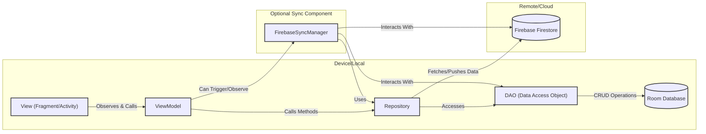

## Explanation of Components and Interactions

1.  **View (Fragment/Activity) (`UI`)**:
    *   **Responsibilities**: Displays data to the user and captures user input.
    *   **Interactions**:
        *   Observes data (usually `LiveData` or `Flow`) exposed by the `ViewModel`.
        *   Calls methods on the `ViewModel` in response to user interactions (e.g., button clicks, form submissions).
        *   **Does NOT directly access the Repository, DAO, or databases.**

2.  **ViewModel (`VM`)**:
    *   **Responsibilities**:
        *   Holds and prepares UI-related data.
        *   Survives configuration changes (like screen rotations).
        *   Acts as an intermediary between the UI and the data layer (Repository).
    *   **Interactions**:
        *   Exposes data (e.g., `StateFlow<List<Task>>`) for the UI to observe.
        *   Calls methods on the `Repository` to fetch or modify data.
        *   Contains business logic related to the UI (e.g., formatting data, deciding what to display).
        *   Can trigger operations in the `FirebaseSyncManager` or observe its status.

3.  **Repository (`REPO`)**:
    *   **Responsibilities**:
        *   Mediates between different data sources (local Room DB, remote Firebase).
        *   Abstracts the data source details from the `ViewModel`. The `ViewModel` doesn't need to know if data comes from local cache or a network request.
        *   Often decides whether to fetch data from the local database or make a network call to Firebase.
        *   Handles data transformation if needed (e.g., mapping network DTOs to local database entities).
    *   **Interactions**:
        *   Accessed by the `ViewModel`.
        *   Uses `DAO`s to interact with the Room Database for local data operations.
        *   Directly communicates with Firebase (e.g., Firestore SDK) for remote data operations (fetching data from Firestore, pushing changes to Firestore).
        *   Used by the sync manager to transfer data to each DB   

Repositories themselves provide the methods for interacting with Firebase (e.g., UserRepository.pushUserToFirestore), but these methods are typically called by the FirebaseSyncManager as part of the synchronization process, not directly by ViewModels or the UI for ongoing data sync.

Exceptions to this pattern include initial user authentication (sign-up/sign-in), which UserRepository handles directly with Firebase Auth, as this is a prerequisite for accessing user-specific data.

4.  **DAO (Data Access Object) (`DAO`)**:
    *   **Responsibilities**:
        *   Provides an abstract interface to the Room Database.
        *   Contains methods for performing CRUD (Create, Read, Update, Delete) operations on specific tables in the Room Database.
        *   Maps SQL queries to Kotlin/Java function calls.
    *   **Interactions**:
        *   Accessed by the `Repository` (and sometimes by `FirebaseSyncManager` for local updates).
        *   Executes SQL queries on the `Room Database`.
        *   Can return data as direct objects, `LiveData`, or `Flow`.

5.  **Room Database (`ROOM_DB`)**:
    *   **Responsibilities**:
        *   An abstraction layer over SQLite that allows for more robust database access while harnessing the full power of SQLite.
        *   Persists data locally on the device.
        *   Serves as the single source of truth for the UI if you follow that pattern.
    *   **Interactions**:
        *   Accessed exclusively through `DAO`s.

6.  **Firebase Firestore (`FIREBASE_DB`)**:
    *   **Responsibilities**:
        *   A NoSQL cloud database for storing and syncing data in real-time.
        *   Acts as the backend data store.
    *   **Interactions**:
        *   Accessed by the `Repository` for direct reads/writes needed by the ViewModel (e.g., fetching fresh data).
        *   Accessed by the `FirebaseSyncManager` for background synchronization tasks.
        *   The FirebaseSyncManager is the primary component responsible for initiating the data transfer between the local Room database (accessed via repositories and DAOs) and Firebase (Firestore and Storage). Its role is to observe changes in Room and push them to Firebase, and to listen for changes in Firebase and update Room, ensuring synchronization.

7.  **FirebaseSyncManager (`SYNC_MANAGER`) (Optional but common for offline-first apps)**:
    *   **Responsibilities**:
        *   Manages the synchronization logic between the local Room Database and Firebase Firestore.
        *   Handles offline queuing of changes made locally.
        *   Listens for changes in the local database (via `DAO` or `Repository`) that need to be pushed to Firebase.
        *   Listens for changes in Firebase (via Firestore listeners) that need to be pulled and saved into the local Room Database.
        *   Resolves conflicts (if applicable, though often handled by "last write wins" or more complex strategies).
    *   **Interactions**:
        *   Uses `Repository` methods or `DAO` methods to update the local Room Database.
        *   Uses `Repository` methods or directly uses Firebase SDKs to push/pull data to/from Firebase Firestore.
        *   Can be triggered by the `ViewModel` (e.g., to initiate a sync) or can run as a background service/worker.

## Data Flow Examples

*   **Reading Data for UI Display (Offline-First Approach):**
    1.  `UI` observes `ViewModel`.
    2.  `ViewModel` requests data from `Repository`.
    3.  `Repository` requests data from `DAO` (which returns a `Flow` or `LiveData`).
    4.  `DAO` queries `Room Database`.
    5.  Data flows back up the chain and updates the `UI`.
    6.  Separately, `FirebaseSyncManager` might update `Room Database` with fresh data from `Firebase Firestore`, which then automatically updates the UI via the observed `Flow`/`LiveData`.

*   **Writing Data (User Input):**
    1.  `UI` captures user input and calls a method on `ViewModel`.
    2.  `ViewModel` calls a method on `Repository` (e.g., `addTask(task)`).
    3.  `Repository` might:
        *   Save the task to `Room Database` via `DAO` (often marking it as `needsSync = true`).
        *   And/or directly attempt to save to `Firebase Firestore`.
    4.  If saved locally and marked for sync, `FirebaseSyncManager` (if observing local changes) will pick up this change and push it to `Firebase Firestore`. After a successful push, it might update the local item (e.g., `needsSync = false`) via `DAO`.

This architecture promotes separation of concerns, testability, and a more maintainable codebase, especially for applications with offline capabilities and data synchronization.