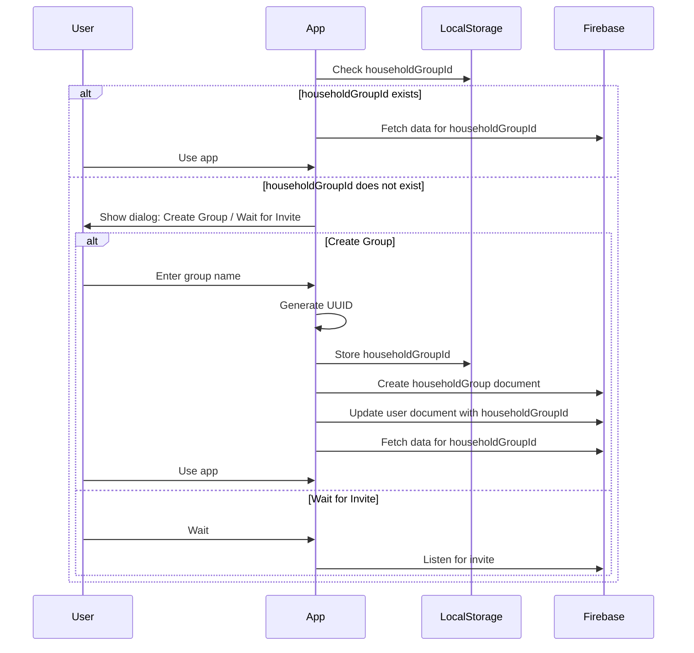

I am already in architect mode. The user wants to discuss how the group ID is determined and implement a feature to create a group upon installing the app.

Here's a plan to implement the new feature:

1.  **Check if the user is part of a group:**
    *   Upon installing the app, check if the user is already associated with a household group. This could involve checking local storage (SharedPreferences or DataStore) or querying the Firebase Authentication user's metadata.
2.  **Show a dialog box if the user is not part of a group:**
    *   If the user is not part of a group, display a dialog box asking if they want to create a new group or wait for an invite.
3.  **Create a new group:**
    *   If the user chooses to create a new group:
        *   Prompt the user for a group name.
        *   Generate a UUID for the `householdGroupId`.
        *   Create a new entry in the `household_groups` table (or Firestore collection) with the group name and `householdGroupId`.
        *   Associate the current user with the new `householdGroupId` in the `users` table (or Firestore collection).
        *   Store the `householdGroupId` in local storage (SharedPreferences or DataStore).
4.  **Wait for an invite:**
    *   If the user chooses to wait for an invite, they should not be able to access the main features of the app until they accept an invitation.

Here's a more detailed breakdown of the implementation:

**1. Data Layer:**

*   **HouseholdGroup Data Class:**
    ```kotlin
    data class HouseholdGroup(
        val id: String, // UUID
        val name: String,
        val createdAt: Timestamp = Timestamp.now()
    )
    ```
*   **HouseholdGroup DAO (if using Room):**
    ```kotlin
    @Dao
    interface HouseholdGroupDao {
        @Insert(onConflict = OnConflictStrategy.REPLACE)
        suspend fun insert(householdGroup: HouseholdGroup)

        @Query("SELECT * FROM household_groups WHERE id = :id")
        suspend fun getHouseholdGroupById(id: String): HouseholdGroup?
    }
    ```
*   **HouseholdGroup Repository:**
    ```kotlin
    class HouseholdGroupRepository @Inject constructor(
        private val householdGroupDao: HouseholdGroupDao,
        private val firestore: FirebaseFirestore
    ) {
        suspend fun createHouseholdGroup(name: String): Result<HouseholdGroup> {
            return try {
                val id = UUID.randomUUID().toString()
                val householdGroup = HouseholdGroup(id = id, name = name)
                householdGroupDao.insert(householdGroup)
                // Also save to Firestore
                firestore.collection("householdGroups").document(id).set(householdGroup).await()
                Result.Success(householdGroup)
            } catch (e: Exception) {
                Result.Error(e)
            }
        }

        suspend fun getHouseholdGroup(id: String): Result<HouseholdGroup?> {
            return try {
                val householdGroup = householdGroupDao.getHouseholdGroupById(id)
                Result.Success(householdGroup)
            } catch (e: Exception) {
                Result.Error(e)
            }
        }
    }
    ```

**2. UI Layer:**

*   **Check for Existing Group:**
    *   In the app's main activity or splash screen, check if the user has a `householdGroupId` stored locally.
*   **Show Dialog:**
    *   If no `householdGroupId` is found, show an AlertDialog or a Compose Dialog.
    *   The dialog should have two options: "Create Group" and "Wait for Invite".
*   **Create Group Flow:**
    *   If the user selects "Create Group":
        *   Show a dialog or screen to enter the group name.
        *   Call a `CreateHouseholdGroupViewModel` to handle the group creation logic.
*   **Wait for Invite Flow:**
    *   If the user selects "Wait for Invite":
        *   Disable access to most app features.
        *   Display a message indicating that they are waiting for an invitation.
        *   Set up a listener for invitation events (e.g., using Firebase Dynamic Links or Cloud Functions).

**3. Firebase Integration:**

*   **Firestore Structure:**
    *   Consider storing household groups in a top-level collection called `householdGroups`.
    *   Each document in the `householdGroups` collection would represent a household group, with the document ID being the `householdGroupId`.
*   **User Association:**
    *   Store the `householdGroupId` as a field in the user's document in the `users` collection.
*   **Security Rules:**
    *   Implement Firebase Security Rules to ensure that users can only access data for their associated household group.

**4. Code Changes:**

*   **Modify `AppDatabase`:**
    *   Add a `HouseholdGroup` entity to the `AppDatabase`.
    *   Create a `HouseholdGroupDao`.
*   **Modify `FirebaseSyncManager`:**
    *   Update the `FirebaseSyncManager` to use the `householdGroupId` when syncing data.
*   **Modify UI:**
    *   Implement the UI elements for creating and selecting household groups.

**5. Diagram**




```xml