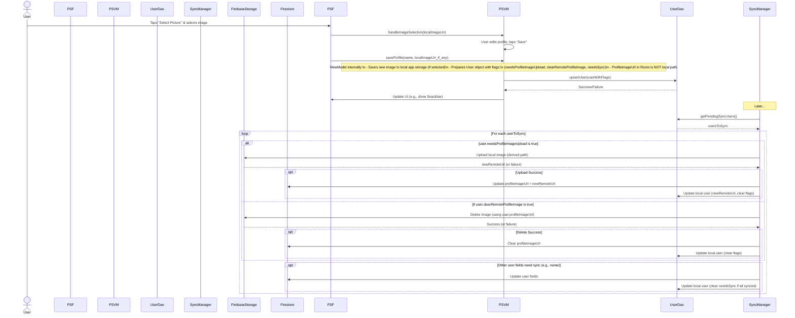

```mermaid
sequenceDiagram
    actor User
    participant ProfileSettingsFragment as PSF
    participant ProfileSettingsViewModel as PSVM
    participant RoomDB_UserDao as UserDao
    participant LocalToRemoteSyncManager as SyncManager
    participant FirebaseStorage
    participant Firestore

    User->>PSF: Taps "Select Picture" & selects image
    PSF->>PSVM: handleImageSelection(localImageUri)
    PSVM->>PSVM: User edits profile, taps "Save"
    PSF->>PSVM: saveProfile(name, localImageUri_if_any)

    Note over PSVM: ViewModel internally:\n - Saves new image to local app storage (if selected)\n - Prepares User object with flags:\n   (needsProfileImageUpload, clearRemoteProfileImage, needsSync)\n - ProfileImageUrl in Room is NOT local path.

    PSVM->>UserDao: upsertUser(userWithFlags)
    UserDao-->>PSVM: Success/Failure
    PSVM->>PSF: Update UI (e.g., show Snackbar)

    Note over SyncManager: Later...
    SyncManager->>UserDao: getPendingSyncUsers()
    UserDao-->>SyncManager: usersToSync

    loop For each userToSync
        alt user.needsProfileImageUpload is true
            SyncManager->>FirebaseStorage: Upload local image (derived path)
            FirebaseStorage-->>SyncManager: newRemoteUrl (or failure)
            opt Upload Success
                SyncManager->>Firestore: Update profileImageUrl = newRemoteUrl
                SyncManager->>UserDao: Update local user (newRemoteUrl, clear flags)
            end
        else if user.clearRemoteProfileImage is true
            SyncManager->>FirebaseStorage: Delete image (using user.profileImageUrl)
            FirebaseStorage-->>SyncManager: Success (or failure)
            opt Delete Success
                SyncManager->>Firestore: Clear profileImageUrl
                SyncManager->>UserDao: Update local user (clear flags)
            end
        end
        opt Other user fields need sync (e.g., name)
            SyncManager->>Firestore: Update user fields
            SyncManager->>UserDao: Update local user (clear needsSync if all synced)
        end
    end

```