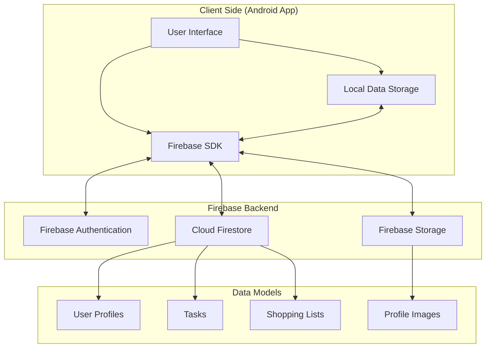
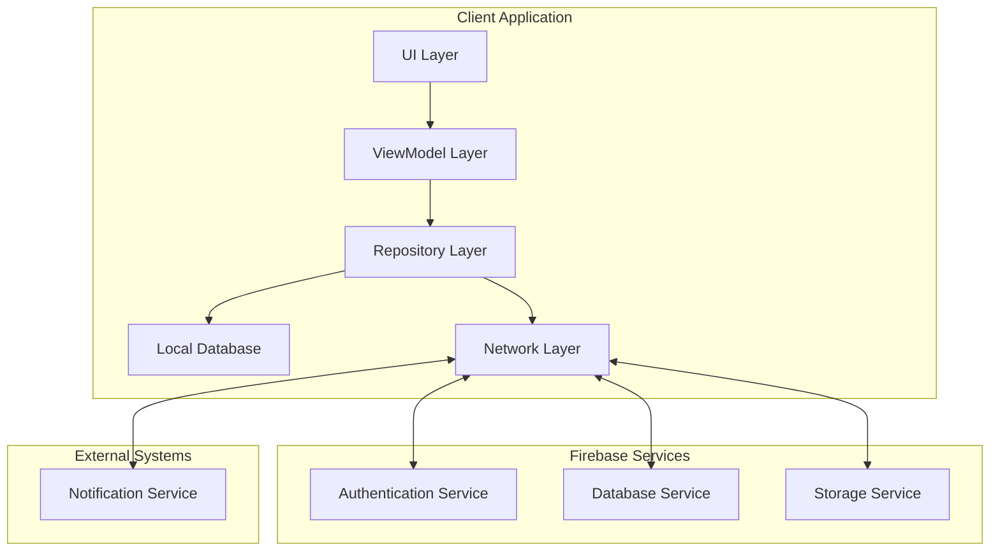
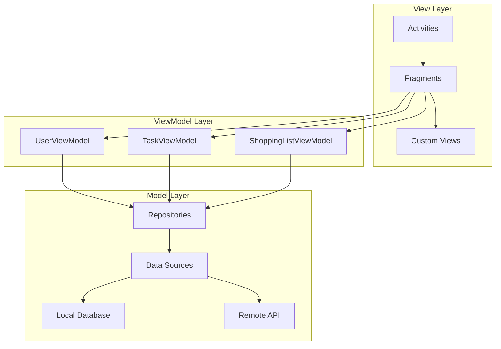

# Homeostasis - Family Task Management App

## 1. Product Requirements Document (PRD)

### 1.1 Product Overview
- A family-oriented task management application for Android devices named "Homeostasis"
- Firebase backend for real-time data synchronization and user management
- Equal access for all family members (no admin/user distinction)

### 1.2 User Stories
#### Tasks
- As a family member, I want to create a new household group
- As a family member, I want to invite others to join my household group via email or id number or QR code
- As a family member, I want to create a new member in the household group and assign a profile picture
- As a family member, I want to create tasks so that everyone knows what tasks are available
- As a family member, I want to assign points to tasks to indicate their importance or difficulty
- As a family member, I want to mark tasks as complete and have the ability to undo this action
- As a family member, I want to specify a category to a task on creation to help with task sorting
- As a family member, I want to view task history to see what has been accomplished
- As a family member, I want to quickly see each member's task scores in a single view, ranked from highest score to lowest
- As a family member, I want to have the ability to reset all task scores and task history
- As a family member, I want to be presented as the first thing I see is a list of tasks i can complete with a date of when it was last completed and by whom
#### Shopping
- As a family member, I want to create and manage multiple shared shopping lists
- As a family member, I want to check off items on the shopping list as they're purchased
- As a family member, I want to quickly add previously purchased items to the current shopping list

### 1.3 Feature Requirements

#### 1.3.1 User Management
- User registration and authentication via Firebase Authentication
- User profile creation with name and profile image
- Equal access rights for all users

#### 1.3.2 Task Management
- Task creation with title, description and point value
- Task viewing (flat or sorting by category)
- Task completion with undo capability
- Task history tracking
- Task category management (add, remove)
- Task scores by member with profile picture, ranking and score differnce between 1st rank and all others

#### 1.3.3 Shopping List
- Create and manage shared shopping list
- Add/remove items from the list
- Check off purchased items
- Access history of previously added items for quick re-addition

### 1.4 Non-Functional Requirements
- Offline functionality with synchronization when online
- Real-time updates across all connected devices
- Intuitive, family-friendly UI
- Fast performance and low battery consumption
- Secure data storage and transmission

## 2. Conceptual Systems Diagram



## 3. System Requirements

### 3.1 Technical Requirements
- Android OS (minimum version: Android 8.0 Oreo / API level 26)
- Firebase account and project setup
- Internet connectivity for synchronization (with offline capabilities)
- Camera access for profile pictures

### 3.2 Development Requirements
- Android Studio
- Kotlin programming language
- Firebase SDK integration
- MVVM architecture pattern
- Material Design components
- Version control system (Git)

### 3.3 Testing Requirements
- Unit testing for business logic
- UI testing for user interactions
- Integration testing for Firebase connectivity
- User acceptance testing with family members

## 4. System of Systems Architecture



### 4.1 Component Descriptions

#### 4.1.1 Client Application Components
- **UI Layer**: Activities, Fragments, and custom views for user interaction
- **ViewModel Layer**: Manages UI-related data, handles user actions
- **Repository Layer**: Single source of truth for data, manages data operations
- **Local Database**: Room database for offline data storage
- **Network Layer**: Handles communication with Firebase services

#### 4.1.2 Firebase Service Components
- **Authentication Service**: Manages user authentication and session
- **Database Service**: Cloud Firestore for storing and syncing application data
- **Storage Service**: Firebase Storage for storing user profile images

#### 4.1.3 External System Components
- **Notification Service**: Firebase Cloud Messaging for real-time notifications

## 5. Android SW and UI Architecture

### 5.1 Software Architecture (MVVM)



### 5.2 Data Models

#### 5.2.1 User Model
```
User {
    id: String
    name: String
    profileImageUrl: String
    createdAt: Timestamp
    lastActive: Timestamp
}
```

#### 5.2.2 Task Model
```
Task {
    id: String
    title: String
    description: String
    points: Integer
    categoryId: String  // Reference to category
    createdBy: String (User ID)
    createdAt: Timestamp
}
```

#### 5.2.3 TaskHistory Model
```
TaskHistory {
    id: String
    taskId: String  // Reference to the task
    userId: String  // User who completed the task
    completedAt: Timestamp  // When the task was completed
    pointValue: Integer  // Store the point value at time of completion
}
```

#### 5.2.4 Category Model
```
Category {
    id: String
    name: String
    color: String  // For UI representation
    icon: String   // Icon identifier for visual representation
    createdBy: String (User ID)
    createdAt: Timestamp
}
```

#### 5.2.5 ShoppingList Model
```
ShoppingList {
    id: String
    name: String
    createdBy: String (User ID)
    createdAt: Timestamp
}
```

#### 5.2.6 Shopping Item Model
```
ShoppingItem {
    id: String
    name: String
    category: String (optional)
    lastUsed: Timestamp
    usageCount: Integer
    createdBy: String (User ID)
    createdAt: Timestamp
}
```

#### 5.2.7 Shopping List Item Model
```
ShoppingListItem {
    id: String
    itemId: String  // Reference to ShoppingItem
    listId: String  // Reference to ShoppingList
    quantity: String (optional)
    notes: String (optional)
    addedBy: String (User ID)
    addedAt: Timestamp
    isChecked: Boolean
    checkedBy: String (User ID)
    checkedAt: Timestamp
}
```

### 5.3 UI Architecture

#### 5.3.1 Main Screens
- Login/Registration Screen
- Home Screen (Task Overview)
- Task Detail Screen
- Create/Edit Task Screen
- Shopping List Screen
- User Profile Screen

#### 5.3.2 Navigation Pattern
- Bottom Navigation for main sections (Tasks, Shopping List, Profile)
- Fragment-based navigation within sections
- Material Design components for consistent UI

#### 5.3.3 UI Components
- RecyclerViews for task and shopping item lists
- CardViews for individual tasks and shopping items
- FloatingActionButtons for creating new tasks/items
- BottomSheets for quick actions
- Dialogs for confirmations

## 6. Implementation Plan

### 6.1 Phase 1: Setup and Basic Structure
- Project setup in Android Studio
- Firebase project creation and configuration
- Basic application structure and navigation
- User authentication implementation

### 6.2 Phase 2: Core Functionality
- Task management features
- Local database implementation
- Firebase synchronization
- Basic UI implementation

### 6.3 Phase 3: Shopping List Feature
- Shopping list data model
- Shopping list UI
- History and quick-add functionality

### 6.4 Phase 4: Refinement and Testing
- UI/UX improvements
- Performance optimization
- Comprehensive testing
- Bug fixes and refinements

### 6.5 Phase 5: Deployment
- Final testing
- Google Play Store preparation
- Release and monitoring

## 7. Firebase Backend Structure

### 7.1 Authentication
- Email/password authentication
- Google Sign-In (optional)

### 7.2 Cloud Firestore Database Structure
```
/users/{userId}
    - name: String
    - profileImageUrl: String
    - createdAt: Timestamp
    - lastActive: Timestamp

/categories/{categoryId}
    - name: String
    - color: String
    - createdBy: String (User ID)
    - createdAt: Timestamp

/tasks/{taskId}
    - title: String
    - description: String
    - points: Integer
    - categoryId: String  // Reference to category
    - createdBy: String (User ID)
    - createdAt: Timestamp

/taskHistory/{historyId}
    - taskId: String  // Reference to the task
    - userId: String  // User who completed the task
    - completedAt: Timestamp  // When the task was completed
    - pointValue: Integer  // Store the point value at time of completion

/shoppingLists/{listId}
    - name: String
    - createdBy: String (User ID)
    - createdAt: Timestamp

/shoppingItems/{itemId}
    - name: String
    - category: String (optional)
    - lastUsed: Timestamp
    - usageCount: Integer
    - createdBy: String (User ID)
    - createdAt: Timestamp

/shoppingListItems/{listItemId}
    - itemId: String  // Reference to ShoppingItem
    - listId: String  // Reference to ShoppingList
    - quantity: String (optional)
    - notes: String (optional)
    - addedBy: String (User ID)
    - addedAt: Timestamp
    - isChecked: Boolean
    - checkedBy: String (User ID)
    - checkedAt: Timestamp

/shoppingHistory/{itemName}
    - lastUsed: Timestamp
    - usageCount: Integer
```

### 7.3 Firebase Storage Structure
```
/profileImages/{userId}.jpg
```

### 7.4 Security Rules
Basic security rules to ensure only authenticated users can read/write data:

```
service cloud.firestore {
  match /databases/{database}/documents {
    // Allow authenticated users to read all data
    match /{document=**} {
      allow read: if request.auth != null;
    }
    
    // Allow users to create and update tasks
    match /tasks/{taskId} {
      allow write: if request.auth != null;
    }
    
    // Allow users to create and update shopping items
    match /shoppingItems/{itemId} {
      allow write: if request.auth != null;
    }
    
    // Allow users to update their own profile
    match /users/{userId} {
      allow write: if request.auth != null && request.auth.uid == userId;
    }
  }
}
```

## 8. Git Repository Structure

The Homeostasis project will be organized in the following Git repository structure:

```
Homeostasis/
├── .gitignore
├── README.md
├── docs/
│   ├── project_plan.md (this document)
│   └── assets/
│       └── diagrams/
├── android/
│   ├── app/
│   │   ├── src/
│   │   │   ├── main/
│   │   │   │   ├── java/com/homeostasis/app/
│   │   │   │   │   ├── ui/
│   │   │   │   │   ├── viewmodel/
│   │   │   │   │   ├── repository/
│   │   │   │   │   ├── data/
│   │   │   │   │   └── util/
│   │   │   │   └── res/
│   │   │   └── test/
│   │   └── build.gradle
│   └── build.gradle
└── firebase/
    ├── firestore.rules
    └── storage.rules