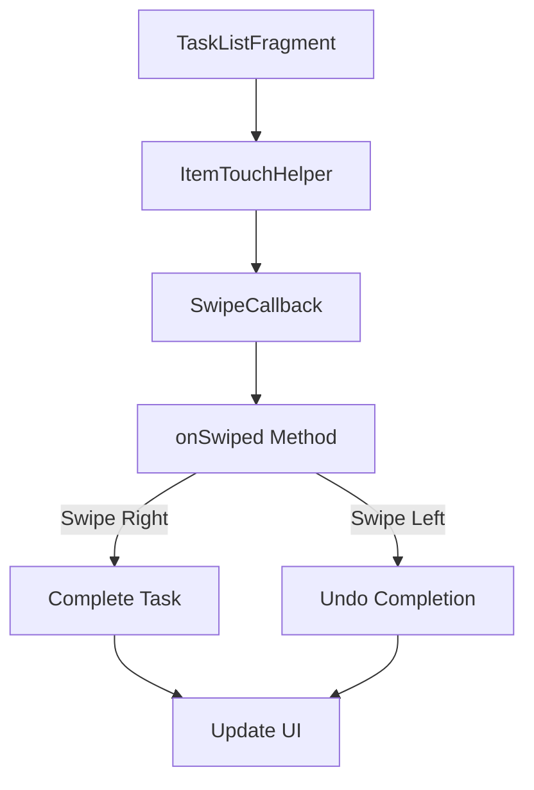
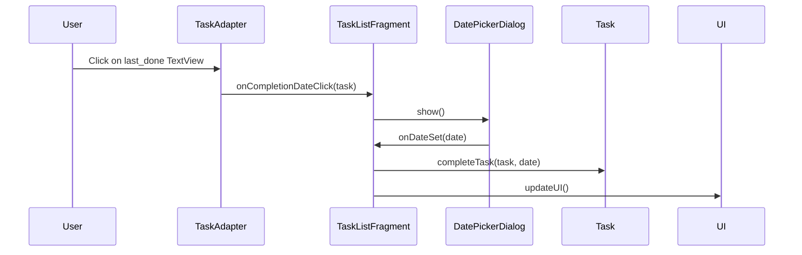
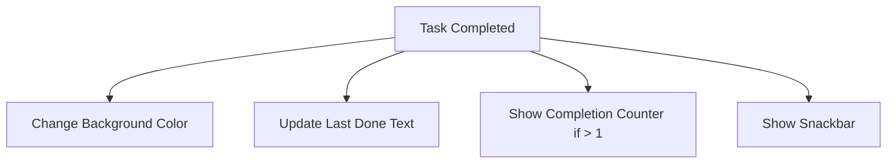
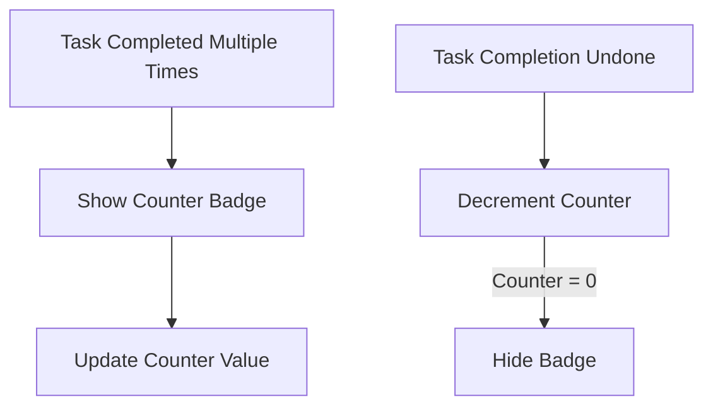
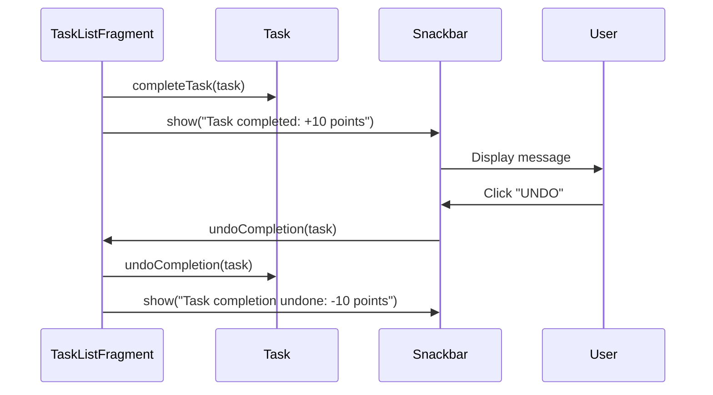
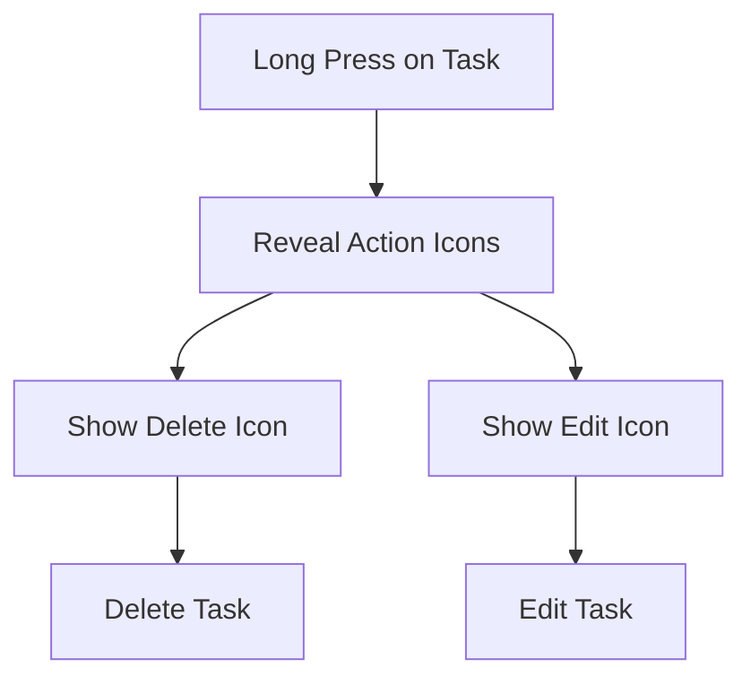
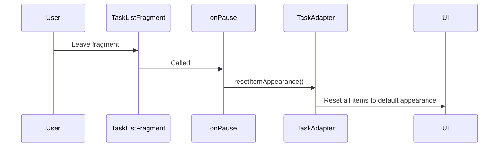
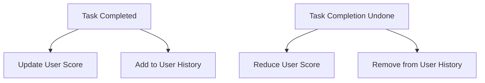

Based on the code I've reviewed and the requirements, I need to create a detailed plan for implementing the task completion functionality. Here's what needs to be done:

1. Update the Task model to include completion-related fields
2. Implement swipe gestures in the TaskListFragment
3. Create a date picker dialog for task completion
4. Implement visual feedback for completed tasks
5. Add a counter badge for multiple completions
6. Implement Snackbar notifications for task completion and undo
7. Add slide-reveal functionality for edit and delete actions
8. Implement reset functionality when leaving the task view

Let me create a detailed plan for each of these components.

# Task Completion Implementation Plan

Based on the requirements and the current code structure, I'll create a detailed plan for implementing the task completion functionality in the Homeostasis app.

## 1. Update the Task Model

We need to enhance the Task model to support completion tracking:

```kotlin
data class Task(
    // Existing fields...
    
    // New fields for completion tracking
    @PropertyName("completionCount")
    val completionCount: Int = 0,
    
    @PropertyName("lastCompletedAt")
    val lastCompletedAt: Timestamp? = null,
    
    @PropertyName("lastCompletedBy")
    val lastCompletedBy: String = "",
    
    @PropertyName("completionHistory")
    val completionHistory: List<TaskCompletion> = listOf()
)

// New data class for tracking individual completions
data class TaskCompletion(
    val completedAt: Timestamp = Timestamp.now(),
    val completedBy: String = "",
    val points: Int = 0
)
```

## 2. Implement Swipe Gestures

We'll use ItemTouchHelper to implement swipe gestures:



Implementation steps:
1. Create a SwipeCallback class extending ItemTouchHelper.SimpleCallback
2. Implement onSwiped method to handle right swipe (complete) and left swipe (undo)
3. Attach the ItemTouchHelper to the RecyclerView

## 3. Date Picker for Task Completion

When clicking on the task completion date area:



Implementation steps:
1. Add click listener to the last_done TextView in TaskAdapter
2. Create a method in TaskListFragment to show DatePickerDialog
3. Implement onDateSet callback to complete the task with the selected date

## 4. Visual Feedback for Completed Tasks



Implementation steps:
1. Create a background selector drawable for task items
2. Update the TaskAdapter to set the appropriate background based on completion status
3. Update the last_done TextView with the completion date and user

## 5. Completion Counter Badge



Implementation steps:
1. Add a TextView for the counter badge in item_task.xml
2. Update the TaskAdapter to show/hide and update the counter based on completionCount
3. Style the counter badge to be visually distinct

## 6. Snackbar Notifications



Implementation steps:
1. Create helper methods in TaskListFragment for showing Snackbars
2. Add undo action to the completion Snackbar
3. Implement undoCompletion method in TaskListFragment

## 7. Slide-Reveal for Edit and Delete

We'll use ItemTouchHelper's onChildDraw method to implement slide-reveal:



Implementation steps:
1. Create a background layout with delete and edit icons
2. Override onChildDraw in SwipeCallback to reveal the background on long press
3. Implement click handlers for the revealed icons

## 8. Reset UI on View Change



Implementation steps:
1. Override onPause in TaskListFragment
2. Add a method in TaskAdapter to reset all items to their default appearance
3. Call this method when the fragment is paused

## 9. User History and Score Updates



Implementation steps:
1. Create UserRepository and UserHistoryRepository classes
2. Implement methods to update user score and history
3. Call these methods when tasks are completed or undone

## Implementation Order

1. Update the Task model with completion-related fields
2. Implement basic swipe gestures for completion and undo
3. Add visual feedback for completed tasks
4. Implement the completion counter badge
5. Add Snackbar notifications
6. Implement date picker for task completion
7. Add slide-reveal functionality for edit and delete
8. Implement reset functionality when leaving the task view
9. Update user history and score