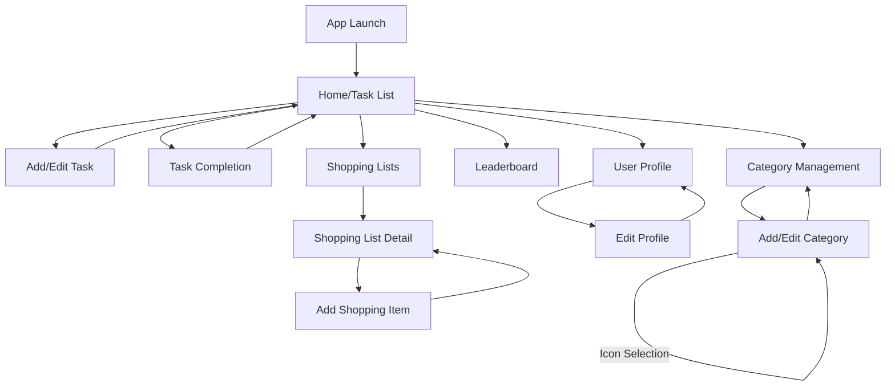

# UI Design Updates for Homeostasis App

Based on the updated requirements, the following changes to the UI design are recommended:

## 1. Main Navigation Structure

The app will use a bottom navigation bar with the following main sections:
- Tasks (Home)
- Shopping Lists
- Leaderboard (score tally and task completion history)
- Profile
- Settings (cloud storage and category management)

## 2. Key Screen Designs

### 2.1 Home Screen (Task List)

```
┌─────────────────────────────────────┐
│ Homeostasis                      +  │ <- Add new task button
├─────────────────────────────────────┤
│ ┌─────────────────────────────────┐ │
│ │ Categories: All | House | School│ │ <- Category filter tabs
│ └─────────────────────────────────┘ │
│                                     │
│ ┌─────────────────────────────────┐ │
│ │ Clean Bathroom         [10 pts] │ │ <- swipe to reveal task delete and edit options
│ │ Category: House                 │ │
│ │ Last done: May 10 4:00pm by Mom │ │ <- Task card with last completion info (date and time)
│ └─────────────────────────────────┘ │
│                                     │
│ ┌─────────────────────────────────┐ │
│ │ Take out trash          [5 pts] │ │
│ │ Category: House                 │ │
│ │ Last done: May 12 4:00pm by Dad │ │
│ └─────────────────────────────────┘ │
│                                     │
│ ┌─────────────────────────────────┐ │
│ │ Homework               [15 pts] │ │
│ │ Category: School                │ │
│ │ Last done: Never                │ │
│ └─────────────────────────────────┘ │
│                                     │
├─────────────────────────────────────┤
│ Tasks | Shop | Score/hist | Me |cog │ <- Bottom navigation
└─────────────────────────────────────┘
```

### 2.2 Task Completion Dialog

```
┌─────────────────────────────────────┐
│         Task Completed!             │
│                                     │
│ Clean Bathroom                      │                          
│ Date [_____▼]                       | <- Completion date, default set to today, can change if necessary. Dropdown calendar
│ +10 points added to your score!     │
│                                     │
│ Your current score: 45              │
│                                     │
│ [UNDO]            [OK]              │
└─────────────────────────────────────┘
```

### 2.3 Leaderboard Screen

```
┌─────────────────────────────────────┐
│ Leaderboard                 [RESET] │ <- Reset scores button
├─────────────────────────────────────┤
│                                     │
│ ┌─────────────────────────────────┐ │
│ │ 🥇 [Profile Pic] Mom     85 pts │ │
│ └─────────────────────────────────┘ │
│                                     │
│ ┌─────────────────────────────────┐ │
│ │ 🥈 [Profile Pic] Dad     70 pts │ │
│ │     (15 pts behind leader)      │ │ <- Points difference from leader
│ └─────────────────────────────────┘ │
│                                     │
│ ┌─────────────────────────────────┐ │
│ │ 🥉 [Profile Pic] Child   45 pts │ │
│ │     (40 pts behind leader)      │ │
│ └─────────────────────────────────┘ │
│                                     │
│  ────────────────────────────────   │
│      Task completion History        │<- scroll further to show task completion history, swipe to reveal delete and edit options
│                                     │
│                                     │ 
├─────────────────────────────────────┤
│ Tasks | Shopping | Leaderboard | Me │
└─────────────────────────────────────┘
```

### 2.4 Shopping Lists Screen

```
┌─────────────────────────────────────┐
│ Shopping Lists                   +  │ <- Add new list button
├─────────────────────────────────────┤
│                                     │
│ ┌─────────────────────────────────┐ │
│ │ Groceries                    >  │ │
│ │ 12 items (5 checked)            │ │
│ └─────────────────────────────────┘ │
│                                     │
│ ┌─────────────────────────────────┐ │
│ │ Hardware Store               >  │ │
│ │ 3 items (0 checked)             │ │
│ └─────────────────────────────────┘ │
│                                     │
│ ┌─────────────────────────────────┐ │
│ │ Pharmacy                     >  │ │
│ │ 2 items (1 checked)             │ │
│ └─────────────────────────────────┘ │
│                                     │
├─────────────────────────────────────┤
│ Tasks | Shopping | Leaderboard | Me │
└─────────────────────────────────────┘
```

### 2.5 Shopping List Detail Screen

```
┌─────────────────────────────────────┐
│ Groceries                        +  │ <- Add item button
├─────────────────────────────────────┤
│ ┌─────────────────────────────────┐ │
│ │ Recent Items:                   │ │
│ │ Milk | Eggs | Bread | Apples    │ │ <- Quick add from history
│ └─────────────────────────────────┘ │
│                                     │
│ ┌─────────────────────────────────┐ │
│ │ [✓] Milk                        │ │
│ │     Added by Mom                │ │
│ └─────────────────────────────────┘ │
│                                     │
│ ┌─────────────────────────────────┐ │
│ │ [✓] Eggs                        │ │
│ │     Added by Dad                │ │
│ └─────────────────────────────────┘ │
│                                     │
│ ┌─────────────────────────────────┐ │
│ │ [ ] Bread                       │ │
│ │     Added by Child              │ │
│ └─────────────────────────────────┘ │
│                                     │
│ ┌─────────────────────────────────┐ │
│ │ [ ] Apples                      │ │
│ │     Added by Mom                │ │
│ └─────────────────────────────────┘ │
│                                     │
├─────────────────────────────────────┤
│ Tasks | Shopping | Leaderboard | Me │
└─────────────────────────────────────┘
```

### 2.6 Add/Edit Task Screen

```
┌─────────────────────────────────────┐
│ New Task                            │
├─────────────────────────────────────┤
│                                     │
│ Title:                              │
│ [________________________]          │
│                                     │
│ Description:                        │
│ [________________________]          │
│ [________________________]          │
│                                     │
│ Category:                           │
│ [House ▼]                           │ <- Dropdown for categories
│                                     │
│ Points:                             │
│ [_____]                             │
│                                     │
│ [CANCEL]                  [SAVE]    │
│                                     │
└─────────────────────────────────────┘
```

### 2.7 Category Management Screen

```
┌─────────────────────────────────────┐
│ Categories                       +  │ <- Add category button
├─────────────────────────────────────┤
│                                     │
│ ┌─────────────────────────────────┐ │
│ │ 🏠 House                   [✏️] │ │ <- Edit button
│ │ Color: 🟦  Icon: 🏠          [❌] │ │ <- Delete button
│ └─────────────────────────────────┘ │
│                                     │
│ ┌─────────────────────────────────┐ │
│ │ 📚 School                  [✏️] │ │
│ │ Color: 🟩  Icon: 📚          [❌] │ │
│ └─────────────────────────────────┘ │
│                                     │
│ ┌─────────────────────────────────┐ │
│ │ 👤 Personal                [✏️] │ │
│ │ Color: 🟪  Icon: 👤          [❌] │ │
│ └─────────────────────────────────┘ │
│                                     │
└─────────────────────────────────────┘
```

### 2.8 Add/Edit Category Screen

```
┌─────────────────────────────────────┐
│ New Category                        │
├─────────────────────────────────────┤
│                                     │
│ Name:                               │
│ [________________________]          │
│                                     │
│ Color:                              │
│ [🟦] [🟩] [🟪] [🟥] [🟨] [⬜]      │ <- Color selection
│                                     │
│ Icon:                               │
│ [🏠] [📚] [👤] [🛒] [🎮] [🍽️]      │ <- Icon selection (first row)
│ [🧹] [🧺] [🚗] [💼] [💰] [📱]      │ <- Icon selection (second row)
│ [More icons...]                     │ <- Scrollable icon grid
│                                     │
│ [CANCEL]                  [SAVE]    │
│                                     │
└─────────────────────────────────────┘
```

### 2.9 User Profile Screen

```
┌─────────────────────────────────────┐
│ My Profile                          │
├─────────────────────────────────────┤
│                                     │
│ ┌─────────────────────────────────┐ │
│ │         [Profile Picture]       │ │
│ │             [EDIT]              │ │
│ └─────────────────────────────────┘ │
│                                     │
│ Name: Mom                           │
│ [________________________] [SAVE]   │
│                                     │
│ Current Score: 85 points            │
│ Rank: 🥇 1st Place                  │
│                                     │
│ Task History:                       │
│ - Clean Bathroom (May 13)           │
│ - Groceries Shopping (May 12)       │
│ - Cook Dinner (May 11)              │
│ - Take out trash (May 10)           │
│                                     │
├─────────────────────────────────────┤
│ Tasks | Shopping | Leaderboard | Me │
└─────────────────────────────────────┘
```

## 3. UI Flow Diagram



## 4. UI Components and Styling

### 4.1 Color Scheme
- Primary Color: #4285F4 (Blue)
- Secondary Color: #34A853 (Green)
- Accent Color: #FBBC05 (Yellow)
- Error Color: #EA4335 (Red)
- Background Color: #FFFFFF (White)
- Surface Color: #F8F9FA (Light Gray)
- Text Colors:
  - Primary Text: #202124 (Dark Gray)
  - Secondary Text: #5F6368 (Medium Gray)
  - Disabled Text: #9AA0A6 (Light Gray)

### 4.2 Typography
- Font Family: Roboto
- Headings:
  - H1: 24sp, Bold
  - H2: 20sp, Bold
  - H3: 16sp, Bold
- Body Text:
  - Body 1: 16sp, Regular
  - Body 2: 14sp, Regular
- Caption: 12sp, Regular

### 4.3 Component Styling
- Cards: Rounded corners (8dp), slight elevation (2dp)
- Buttons:
  - Primary: Filled, rounded corners (4dp)
  - Secondary: Outlined, rounded corners (4dp)
- Text Fields: Outlined, rounded corners (4dp)
- Bottom Navigation: Fixed, with icons and labels

### 4.4 Animations
- Page transitions: Slide animations
- Task completion: Confetti animation
- Score updates: Counter animation