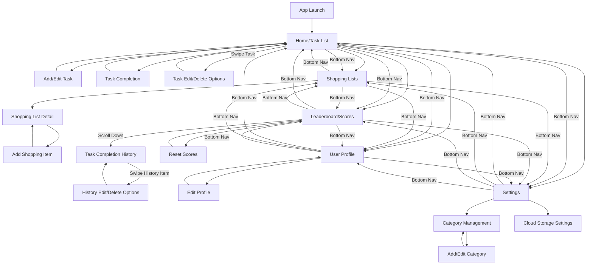

# Updated UI Flow Diagram for Homeostasis App

Based on your edits to the UI design document, I've updated the UI flow diagram to reflect the new navigation structure, additional functionality, and screen interactions.

## Key Changes in the Updated Flow:

1. **Added Settings Section**:
   - New navigation item for Settings
   - Category Management moved to Settings
   - Added Cloud Storage Settings

2. **Enhanced Task Interactions**:
   - Added swipe functionality for tasks to reveal edit/delete options
   - Added date selection in task completion dialog

3. **Enhanced Leaderboard**:
   - Added scroll down to view task completion history
   - Added swipe functionality for history items to reveal edit/delete options

4. **Simplified Bottom Navigation**:
   - Updated with more concise labels (Tasks, Shop, Score/hist, Me, cog)
   - All sections accessible from any other section via bottom navigation

5. **Additional Details**:
   - Time information added to task completion history
   - Multiple shopping lists support
   - Task categorization and filtering

This updated flow diagram better represents the user journey through the application based on your UI design changes.